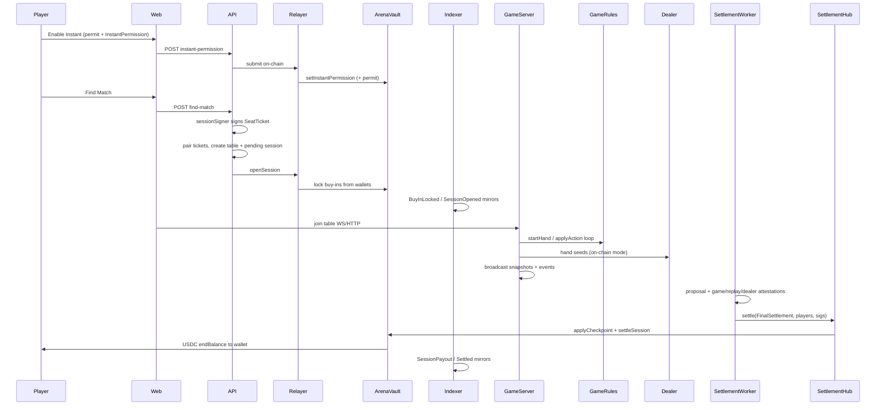

# Mozetto Platform Architecture

**Status:** Anvil-complete Instant Mode custody loop; Base Sepolia / mainnet contracts not yet deployed.  
**Product framing:** On-chain-custodied and settled poker with verifiable off-chain execution — **not** fully trustless mental poker, and **not** an AMM-style DEX. The money path is designed to be **DEX-like / non-custodial session custody**: funds stay in the player’s wallet until a match locks them; settle returns USDC to the wallet.

This document describes everything built so far: blockchain, Instant Mode, game engine, realtime, Supabase/Postgres roles, terminology, what is innovative, what is missing, and how the pieces fit together.

---

## 1. One-sentence model

Mozetto is a **hybrid autonomous poker arena**: players (or their AI loadouts) play No-Limit Hold’em in a realtime TypeScript engine; for on-chain mode, buy-ins are locked in an **ArenaVault** on Base-family chains via EIP-712 seat tickets; after play, a **quorum of attestors** settles stacks and the vault pays winners back to their wallets. Supabase/Postgres coordinates matchmaking, auth, ratings, and UI mirrors — it must **never** be the final authority over real money.

---

## 2. Monorepo map

| Path | Role |
|------|------|
| `apps/web` | Next.js player UI (Wagmi/SIWE, Instant Play, wallet, tables) |
| `apps/admin` | Ops dashboard (token-gated) |
| `services/api` | REST: auth, lobby, wallet, Instant/arena-onchain, admin, verify |
| `services/game-server` | Authoritative NLHE runtime + WebSockets |
| `services/agent-runtime` | AI seat decision service (`shark` / `professor` / `fox` / `machine`) |
| `services/dealer` | Dealer seed commitments, hand-seed derivation, settlement attestation |
| `services/replay-verifier` | Replays canonical event hash chain; signs FinalSettlement |
| `services/chain-indexer` | Sole writer of vault→ledger mirrors; net-worth snapshots |
| `services/settlement-worker` | Builds settlement proposals, collects attestations, submits hub settle |
| `packages/game-rules` | Pure NLHE engine (hands, streets, pots, rake, showdown) |
| `packages/database` | Migrations, ledger, matchmaking, on-chain match helpers, ratings glue |
| `packages/ratings` | Glicko-2 |
| `packages/shared-types` | Zod schemas, seat-ticket hashes, WS message types |
| `packages/blockchain` | ABIs, EIP-712 types, chain config facade |
| `packages/chain-manifest` | Per-network deployment JSON → generated TS |
| `contracts/` | Foundry: vault, hub, registry, randomness, MockUSDC |

### Local ports (`scripts/start-local.sh`)

| Port | Process |
|------|---------|
| 8545 | Anvil (chain id `31337`) |
| 3000 | Web |
| 3001 | Admin |
| 4000 | API |
| 4001 | Game-server |
| 4002 | Agent-runtime |
| 4003 | Dealer |
| 4004 | Replay-verifier |
| (no HTTP) | Chain-indexer, settlement-worker |

---

## 3. Two worlds: Demo vs On-chain

Mozetto deliberately keeps **two separate account kinds**. You sign out to switch; they do not share balances.

| | **Demo** | **On-chain** |
|--|----------|--------------|
| Auth | Supabase email → session JWT | SIWE (wallet signature) → session JWT |
| Money SoT | Postgres ledger (paper USDC) | `ArenaVault` + ERC-20 wallet |
| Buy-in | `lockBuyIn` available → escrow | SeatTicket → `openSession` lock |
| Randomness | Local random seed | Dealer HKDF + VRF word (or fallback) |
| Event provenance | `hand_events` (sha256 chain) | + `canonical_game_events` (keccak) |
| Settlement | Cashout / `releaseSession` in DB | Hub quorum → `settleSession` → wallet |
| UI | Paper faucet | Instant Play, mUSDC/USDC, live chain reads |

**Rule:** Demo ledger *is* the money. On-chain ledger is a **playable mirror** for join/UX/history; the vault is the money.

---

## 4. Truth-source hierarchy (critical)

| Information | Authoritative source | Postgres / Supabase role |
|-------------|----------------------|---------------------------|
| Actual USDC held | `ArenaVault` token balance | — |
| Available / session-locked (real) | `ArenaVault` | Mirror / projection only |
| Wallet ERC-20 balance | Token contract | Chart snapshots only |
| Game templates / rake bounds | `TableRegistry` | Lobby catalog also in `games` / `tables` |
| Live hand state | Game-server in-memory + event log | Persisted `hands` / `hand_events` |
| Private cards | Confidential dealer | Commitments mirrored |
| Randomness provenance | Dealer commitment + VRF | `randomness_*` tables |
| Final payouts | Settlement hub → vault | `settlement_*` projections |
| Matchmaking queue | API + `seat_tickets` | Coordination SoT (off-chain) |
| Ratings / leagues policy | Glicko + TS league config | SoT for competitive meta |
| UI balances / history | — | Projection (must not override vault) |

---

## 5. Blockchain stack

### 5.1 Networks

| Env | Chain ID | USDC | Contracts in-repo |
|-----|----------|------|-------------------|
| Anvil | 31337 | MockUSDC (faucet, EIP-2612) | Fully deployed (`packages/chain-manifest/deployments/anvil.json`) |
| Base Sepolia | 84532 | Circle test USDC | Addresses currently **null** (script exists) |
| Base Mainnet | 8453 | Native USDC | Addresses currently **null** |

Manifest rejects MockUSDC / faucet on Base mainnet.

### 5.2 Contracts

#### `MockUSDC`
Local 6-decimal ERC-20 with `faucet()` and EIP-2612 `permit`. Used only on Anvil for wallet-visible test funds.

#### `ArenaVaultV1` — session custody vault
EIP-712 domain: `MozettoArenaVault` / `1`.

**Balances per user:**
- `available[user]` — optional idle vault balance (legacy deposit path)
- `lockedBySession[sessionId][user]` / `totalLocked[user]` — buy-ins locked for a match
- `accruedProtocolFees` — rake held by vault

**Key flows:**
1. `deposit` / `withdraw` — move USDC ↔ idle `available` (not required for Instant Play).
2. `openSession(config, tickets[], signatures[])` — relayer/settlement only; atomically verifies tickets and locks buy-ins.
3. `settleSession(sessionId, players[], rake)` — settlement hub only; **pays `endBalance` to each player’s ERC-20 wallet**; conservation: `Σ startLocked == Σ endBalance + rake`.
4. `applyCheckpoint` — advances sequence + balance/event roots during/after play.
5. `emergencyExit` — after delay, Merkle proof against last balance root → transfer to player.
6. **InstantPermission** — scoped automation (see §6).

**Buy-in funding order (`_lockFromTicket`):**
1. Take from idle `available` first.
2. Pull remainder from wallet via `transferFrom` (`fromWallet`).
3. Emit `BuyInLocked(sessionId, player, fromAvailable, fromWallet)`.

**Solvency target (off-chain audit):**  
`usdcBalance() == Σ available + Σ locked + accruedProtocolFees`.

#### `PokerSettlementHubV1`
EIP-712 domain: `MozettoPokerSettlement` / `1`.  
Type: `FinalSettlement(sessionId, finalSequence, eventRoot, handRoot, balanceRoot, totalRake, deadline)`.

- Attestor set + `minSignatures` (default 2).
- `settle` → `vault.applyCheckpoint` + `vault.settleSession`.
- Signatures via ECDSA / ERC-1271 (`SignatureChecker`).

#### `TableRegistryV1`
Immutable game templates (seats, clocks, rake, buy-in bounds, engine/rules/profile hashes). Only enable/disable can change after register.

#### `CheckpointRegistryV1`
Owner-anchored Merkle history (`sessionId`, sequence, event/balance roots). Periodic transparency anchors — still centralized ownership.

#### `RandomnessCoordinatorV1`
Seed-batch commit + **stub** VRF (`fulfillMock` / owner paths). Chainlink consumer is **not** production-wired. Local Anvil uses `ENABLE_MOCK_VRF=1`.

### 5.3 EIP-712 typed data (custody)

**SeatTicket** (authorizes one buy-in lock):
```
SeatTicket(
  address player,
  bytes32 gameTemplateId,
  uint256 buyIn,
  bytes32 controllerHash,
  bytes32 agentProfileHash,
  uint64 expiresAt,
  uint256 nonce,
  bytes32 matchmakingPool
)
```

**InstantPermission** (authorizes Mozetto to sign SeatTickets within caps):
```
InstantPermission(
  address player,
  address sessionSigner,
  uint256 spendCap,
  uint256 maxSingleBuyIn,
  uint64 expiresAt,
  uint256 nonce,
  bool enabled
)
```

**FinalSettlement** (attested end-of-session):
```
FinalSettlement(
  bytes32 sessionId,
  uint64 finalSequence,
  bytes32 eventRoot,
  bytes32 handRoot,
  bytes32 balanceRoot,
  uint256 totalRake,
  uint256 deadline
)
```

### 5.4 Commitment hashes (rules binding)

Defined in `packages/shared-types/src/seat-ticket.ts`:

| Constant | Meaning |
|----------|---------|
| `NLHE_HU_STANDARD_V1_TEMPLATE_ID` | Game template id for HU ranked NLHE |
| `POKER_ENGINE_HASH` | Frozen identity of the poker rules/engine version at open |
| `PROFILE_SET_HASH` | Frozen identity of the allowed AI profile set |
| `CONTROLLER_HASH` | Identity of the seat decision-controller implementation |
| Per-ticket `agentProfileHash` | Which AI profile (`fox`, etc.) this seat committed to |

These do **not** load code on-chain; they **bind custody** to “which rules/AI set were agreed when money locked.”

---

## 6. Instant Mode (DEX-like UX)

### 6.1 Product intent

- Wallet ERC-20 is the primary balance (navbar / wallet page live-read via Wagmi).
- No mandatory idle deposit into the platform for Instant play.
- Enable once → **Find Match with zero wallet popups** for 30 days within a spend budget.
- Mozetto **fronts and submits** open/settle txs; disclosed **match fee / rake** covers network costs — not “free poker.”
- User can revoke; unused funds remain in the wallet.

### 6.2 Enable flow

1. Player connects wallet + SIWE on-chain profile.
2. UI opens Instant sheet: editable **total spend budget**, **per-match max**, fixed **30-day** duration.
3. Player signs:
   - EIP-2612 **Permit** (token allowance to vault, preferably capped to spend budget), and
   - EIP-712 **InstantPermission** (sessionSigner = Mozetto Instant signer, caps, expiry).
4. API relayer (`SESSION_RELAYER_PRIVATE_KEY`) submits both on-chain.
5. Status becomes enabled when: permission active + not expired + remaining spend > 0 + allowance sufficient.

### 6.3 Find Match (popup-free)

1. API checks Instant auth on-chain (signer, expiry, maxSingleBuyIn, remainingSpend, wallet balance, allowance).
2. Dedicated **`INSTANT_SESSION_SIGNER_PRIVATE_KEY`** signs a `SeatTicket` (this key never sends txs).
3. Ticket stored in `seat_tickets`; matchmaking pairs two tickets.
4. Relayer calls `openSession`; vault may `transferFrom` wallets.
5. Indexer mirrors Instant wallet locks so game-server join still works against the ledger projection.
6. After play, settle pays **to wallet**; Instant `spent` is **not** refilled (anti-drain if signer is compromised).

### 6.4 Instant invariants

```
buyIn ≤ maxSingleBuyIn
spent + buyIn ≤ spendCap      // never refilled by settle
expiresAt > now
signature ∈ { player, sessionSigner }
funding = fromAvailable + transferFrom(wallet, remainder)
settle: endBalance → wallet; spent unchanged
revoke: enabled=false (+ optional approve(0))
```

### 6.5 Key roles (must stay distinct in production)

| Role | Env var | On-chain | Job |
|------|---------|----------|-----|
| Session relayer | `SESSION_RELAYER_PRIVATE_KEY` | `vault.sessionRelayer` | Pays gas for `openSession`, permit, InstantPermission |
| Instant session signer | `INSTANT_SESSION_SIGNER_PRIVATE_KEY` | `instantAuth.sessionSigner` | Signs SeatTickets under caps — **not** a tx sender |
| Settlement / attestors | `SETTLEMENT_*`, `GAME_ATTESTOR_*`, `REPLAY_ATTESTOR_*`, `DEALER_ATTESTOR_*` | Hub attestors | Sign FinalSettlement; submit `hub.settle` |
| Owner / Safe | Deploy / ops | Ownable | Pause, set relayer/hub, templates |

Local Anvil often uses account `#0` for relayer/settlement and `#2` for Instant signer — fine for tests only.

### 6.6 Fallback

If Instant is disabled, player can still manually sign SeatTickets (`signAndSubmitSeatTicket`) — compatibility path.

---

## 7. How a match works end-to-end



### Demo shortcut

Same engine and WebSocket path, but `findArenaMatch` uses paper ledger balances and never calls the vault.

---

## 8. Game engine (detailed)

**Package:** `@mozetto/game-rules` (`packages/game-rules/`)

| File | Responsibility |
|------|----------------|
| `holdem.ts` | Table state, seats, streets, legal actions, pots, rake, showdown |
| `cards.ts` | Deck shuffle, seed commit helpers |
| `hand-rank.ts` | Best-hand evaluation / compare |
| `equity.ts` | All-in runout / hero equity helpers |
| `canonical-event.ts` | Keccak hash-chain format `mozetto-poker-v1` for settlement |

### 8.1 State machine (streets)

`waiting` → `preflop` → `flop` → `turn` → `river` → `showdown` → `settlement` → (next hand) `waiting`

### 8.2 Core APIs

- `createTable` / `seatPlayer` / `clearSeat` / `foldSeat`
- `startHand` — button, shuffle, blinds, hole cards, first actor
- `getLegalActions` / `applyAction` — fold, check, call, bet, raise, all-in
- `buildPots` / `settleShowdown` / `foldWin` — side pots, rake, odd chips
- `isAllInRunout` / `continueRunout` — all-in board runout without further betting
- `publicView` / `privateView` — what spectators vs seated players see

### 8.3 Stack / pot accounting

Chips leave stacks into `bet` / `totalBet` / pot via `takeChips`. At settlement, winners’ stacks are credited; rake is removed per `rakePct` / `rakeCap`. The game-server then reconciles Postgres escrow to stacks (`rebalanceEscrowToStacks`) so leave/cashout matches the engine.

### 8.4 Host: `TableRuntime` (`services/game-server`)

Loop (simplified):
1. Wait until ≥2 seated players with stack > 0.
2. `beginHand()` → `startHand()` (on-chain: fetch dealer seed / VRF word).
3. While someone must act: human WS action or AI controller → `applyAction`.
4. All-in runout if needed.
5. On `settlement`: sync stacks to DB, prepare for next hand or session end.

Every persisted event increments a sequence, hashes into `hand_events`, and broadcasts to subscribers.

---

## 9. Realtime protocol (game-server)

**Transport:** WebSocket (+ HTTP join/leave/action helpers).  
**Schemas:** `packages/shared-types` (`WsClientMessageSchema`, etc.).

### Client → server

| Type | Purpose |
|------|---------|
| `auth` | Session token |
| `subscribe_table` | Attach as player or spectator |
| `join_table` | Seat + buy-in + agent config |
| `leave_table` | Cash out / vacate |
| `player_action` | Poker action + amount |
| `owner_command` | Sit out, resume, top-up, coaching |
| `replay_from` | Catch-up after sequence |
| `ping` | Heartbeat |

### Server → client

| Type | Purpose |
|------|---------|
| `hello` | Protocol version / identity |
| `snapshot` | Full public or private view + legal actions + clock |
| `event` | Table event (hash-chained) |
| `private_state` | Hole cards / private payloads |
| `joined` / `left` / `ok` / `error` / `pong` | Lifecycle |

**Authority during a hand:** game-server memory is SoT for cards, pot, acting seat, and clocks. Chain is **not** updated per street.

---

## 10. AI agents

**Service:** `services/agent-runtime`  
**Profiles:** `shark`, `professor`, `fox`, `machine`  
**Wiring:** `services/game-server/src/controllers.ts`

- `DeterministicBotController` — calls agent-runtime heuristics.
- `SiliconFlowController` — optional LLM path when API key set (not for `machine`).
- `TimeoutFallbackController` — clock expiry → fold/check.

Humans act when a player WS client is connected for that seat (unless `HUMAN_PLAY=0`). Agents are **loadouts** on an account — Glicko ratings are account-owned, not agent-owned.

Seat tickets embed `CONTROLLER_HASH` + `agentProfileHash` so the locked funds are bound to a controller/profile commitment.

---

## 11. Dealer, randomness, replay, settlement

### Dealer (`services/dealer`)
- `POST /v1/dealer/commit` — create secret batch + Merkle `dealerRoot`.
- `POST /v1/dealer/hand-seed` — HKDF-SHA256 hand seed from secret + VRF word.
- `POST /v1/dealer/attest` — signs FinalSettlement as dealer attestor.

### Randomness
- Production intent: Chainlink VRF via `RandomnessCoordinator`.
- Local: `ENABLE_MOCK_VRF=1` mock fulfill in settlement-worker.
- Gap: coordinator is still stub/owner-driven; not full Chainlink consumer wiring.

### Replay-verifier (`services/replay-verifier`)
- Loads `canonical_game_events`, verifies hash chain from genesis.
- Signs FinalSettlement as the **replay** attestor (one leg of 2-of-3 quorum).

### Settlement-worker (`services/settlement-worker`)
- Builds `settlement_proposals` from ending stacks / event roots.
- Collects game + replay + dealer attestations.
- Submits `PokerSettlementHub.settle` when keys/config present.
- Also hooks Glicko after successful settle.
- **Known gap:** ABI field naming drift vs current Solidity has been observed historically — treat live mainnet settle path as needing continuous alignment tests.

### Quorum model
Default hub `minSignatures = 2` among configured attestors (game, replay, dealer). This is **attested off-chain execution**, not on-chain card dealing.

---

## 12. Supabase / Postgres roles (what backend still does)

Supabase (Postgres + Auth) is the **coordination and projection layer**.

### Auth
- Demo: Supabase Auth email → bootstrap profile + $5k paper ledger.
- On-chain: SIWE nonce in `siwe_nonces` → `bootstrap_onchain_profile` → cookie JWT with wallet + chainId.
- On-chain cookie wins over leftover demo Bearer in the same browser.

### What DB stores
Profiles, wallets, dual-mode ledger, lobby tables/seats/sessions, hands/events, agents, seat tickets / matchmaking batches / onchain sessions, chain cursors/events, vault deposit mirrors, settlements/checkpoints, ratings (Glicko), notifications, feature flags, net-worth snapshots.

### Ledger duality (on-chain mode)
| Event | Ledger mirror action |
|-------|----------------------|
| Vault deposit indexed | Credit `user_available` (onchain book) |
| Vault withdraw indexed | Debit available |
| Instant BuyInLocked `fromWallet` | Credit then lock into escrow so join works |
| Session cashout Instant | Escrow → clearing (not idle available) |
| SessionPayout to wallet | Debit durable playable mirror |
| Reconcile fail | Can disable `onchain_matchmaking` flag |

**Indexer is the only writer of vault mirror credits** (`client_credit_deposit` feature flag is false).

### Still backend-reliant (honest list)
1. Authoritative game engine and clocks  
2. Dealer secrets / card privacy  
3. Matchmaking and seat-ticket queue  
4. Instant session signer + relayer keys  
5. AI agent runtime  
6. Glicko / league policy / pair caps  
7. Session JWT / SIWE nonce store  
8. Ledger mirrors + reconcile kill-switch  
9. Demo paper economy  
10. Notifications, admin ops, net-worth charts  

---

## 13. Wallet UX (current product surface)

Built for Anvil Instant Mode:

- **Live balances everywhere** — `useMozettoBalances`: wallet ERC-20, `totalLocked`, legacy idle, net worth; Topbar/Nav/home/casino/table/poker/wallet agree.
- **Split-flap number animations** on balance changes.
- **Wallet dashboard** — Mozetto net worth hero, Get Test mUSDC → `/wallet/test-musdc`, Instant Play at bottom, no “Arena Balance advanced” for Instant users.
- **Net-worth graph** — minute snapshots from indexer + `GET /v1/wallet/net-worth` + SVG chart.
- User-facing name is **Mozetto**; `ArenaVaultV1` remains the internal contract name.

---

## 14. What “DEX” means here (and what it does not)

### DEX-like properties we aim for
- Non-custodial idle funds (wallet is home).
- Session-scoped locks only.
- On-chain settlement conservation + settle-to-wallet.
- User-revocable, capped automation (InstantPermission) instead of “deposit and trust the platform ledger.”
- Transparent fee language (rake / match fee, not pretend gas is free).

### Not a classic DEX
- No AMM, order book, or swap pool.
- Cards and actions are **not** executed as L1 txs per street.
- Matching is off-chain.
- Dealer privacy implies residual trust (attested, not mental poker).
- Operator keys (relayer, session signer, attestors) are part of the trust model until AA / decentralized attestors mature.

### How to make it *more* DEX over time
1. Deploy + audit vault/hub on Sepolia → Base.  
2. Keep Instant caps as default; forbid unlimited approve on mainnet.  
3. Move attestors to HSM/KMS + Safe ownership + timelock.  
4. Wire real Chainlink VRF; tighten dealerRoot provenance to openSession.  
5. Optional Account Abstraction / Spend Permissions / paymaster for gas UX without widening custody.  
6. Reduce ledger mirror as join authority — join affordability purely from chain reads.  
7. Longer term: MPC/mental poker or state-channel style action proofs if product requires stronger trustlessness.  
8. Fix any settlement-worker ABI drift with continuous integration against deployed ABIs.

---

## 15. What is innovative (today)

1. **Hybrid Instant custody** — Polymarket-like “enable once, play many” UX, but with **on-chain spend caps that do not refill on settle**, so a compromised platform signer cannot cycle settle→relock to drain a wallet.
2. **SeatTicket + InstantPermission dual path** — full player-signed tickets remain valid; Instant is scoped automation, not a second custodian.
3. **Rules binding at lock time** — engine/profile/controller hashes in tickets and session config.
4. **Attested realtime engine** — low-latency NLHE with canonical event hash chains and multi-attestor settlement, instead of putting every action on-chain.
5. **Dual-world accounts** — demo paper and on-chain money never mix.
6. **Indexer as sole money-mirror writer** — UI can be fast without letting the client invent deposits.
7. **AI-first seating model** — humans and agents share the same engine; ratings attach to accounts, agents are swappable loadouts.

---

## 16. What exists vs what is missing

### Exists (Anvil / codebase)
- Full Foundry vault + InstantPermission + settle-to-wallet + Foundry tests  
- Instant enable/revoke UX + auto SeatTickets + Find Match path  
- Live wallet balances + faucet page + net-worth snapshots/chart  
- Game engine + WS realtime + AI controllers  
- Dealer / replay / settlement-worker skeleton + mock VRF  
- Chain indexer mirrors + reconcile kill-switch  
- Demo mode full paper loop  
- Admin overview surfaces  

### Missing / incomplete for production DEX-grade
| Gap | Why it matters |
|-----|----------------|
| No Sepolia/mainnet deployed addresses | Cannot play real testnet/mainnet USDC yet |
| No independent audits | Vault/hub/engine/ops risk |
| VRF not production-wired | Randomness trust still operator-heavy |
| Settlement ABI/path hardening | Must continuously match Solidity |
| CheckpointRegistry centralized | Transparency anchors not multi-party |
| Key hygiene | Shared Anvil keys ≠ Safe/KMS production |
| AA / Spend Permissions | Optional UX; not required for custody correctness |
| Pure mental poker | Out of scope; would replace dealer trust model |
| Compliance / limits / bounty | Product/legal gates for public money |

See also `docs/MAINNET_READINESS.md` and `contracts/README.md`.

---

## 17. Terminology glossary

| Term | Definition |
|------|------------|
| **Arena / Ranked Arena** | League-based HU matchmaking product surface |
| **ArenaVault** | On-chain session custody contract (internal name); UI says Mozetto |
| **Available** | Idle vault balance (legacy deposit); Instant does not require it |
| **At tables / Locked** | `totalLocked` — USDC locked in open sessions |
| **Buy-in** | Fixed league entry amount locked at session open |
| **Canonical event** | Keccak-chained public game event for settlement (`mozetto-poker-v1`) |
| **Checkpoint** | Sequenced balance/event root applied on vault/hub; also registry anchors |
| **Controller** | Code that chooses seat actions (human, bot, LLM, timeout) |
| **Dealer root** | Commitment to dealer secret batch / seed provenance |
| **Demo mode** | Paper USDC world; Postgres ledger is SoT |
| **Emergency exit** | Delayed player exit via Merkle proof if settlement stalls |
| **Escrow (ledger)** | Postgres book for chips at table (mirror / demo) |
| **FinalSettlement** | EIP-712 attested end-of-session payload |
| **Find Match** | API matchmaking entry; Instant auto-signs tickets |
| **Game-server** | Authoritative realtime NLHE host |
| **Glicko-2** | Account skill rating system |
| **Hand** | One dealt round of NLHE |
| **Instant Mode** | Scoped permission + allowance so joins need no wallet popup |
| **InstantPermission** | On-chain struct/type authorizing a sessionSigner under caps |
| **League** | Buy-in tier (Bronze/Silver/Gold/Platinum…) |
| **Ledger mirror** | Postgres projection of on-chain money for UX/join |
| **Matchmaking pool** | `bytes32` key = chain + league for pairing tickets |
| **mUSDC** | MockUSDC on Anvil (valueless test token) |
| **Net worth** | Wallet + locked + legacy idle Mozetto |
| **On-chain mode** | Wallet SIWE profile; vault custody |
| **Open session** | Vault call that locks buy-ins and creates session |
| **Profile kind** | `demo` \| `onchain` |
| **Rake** | Protocol fee taken from pots / settlement |
| **Relayer** | Hot wallet that submits custody txs and pays gas |
| **Seat** | Position at a table (engine + DB) |
| **Seat ticket** | EIP-712 authorization to lock a buy-in |
| **Session (custody)** | On-chain match id with locked funds |
| **Session (table)** | Postgres `table_sessions` — player seated at a table |
| **Session signer** | Key that signs Instant SeatTickets within caps |
| **Settlement hub** | Contract that verifies attestations and settles the vault |
| **Street** | Betting round (preflop/flop/turn/river/…) |
| **Table** | Lobby + runtime instance of a game |
| **TableRuntime** | In-memory host wrapping the engine for one table |
| **Template** | Immutable game config in TableRegistry |
| **VRF** | Verifiable random function (seed words for dealing) |

---

## 18. How everything fits (mental model)

Think of Mozetto as **three layers**:

1. **Money layer (chain)** — ERC-20 + ArenaVault + InstantPermission + SettlementHub. Authoritative for USDC. Instant Mode makes this feel like a DEX wallet app.
2. **Play layer (realtime)** — game-server + `@mozetto/game-rules` + WebSockets + AI. Authoritative for cards and actions. Fast; not on L1 per action.
3. **Coordination layer (Supabase/API)** — identity, matchmaking, mirrors, ratings, notifications, admin. Makes the product usable; must not silently become a custodial bank for on-chain mode.

Innovation sits at the **boundary**: lock money on-chain with cryptographic commitments to rules/AI, play at game-server latency, then settle with multi-attestor proofs back to wallets — with Instant automation that is **scoped and non-refilling**, so smooth UX does not equal custody.

---

## 19. Practical local verification checklist

1. Anvil on `:8545`, contracts redeployed, manifest synced to `.env.local`.  
2. `INSTANT_SESSION_SIGNER_PRIVATE_KEY` set and **≠** relayer key.  
3. Import **current** MockUSDC address in MetaMask (redeploys change it).  
4. Get Test mUSDC → Enable Instant Play → Find Match (no seat-ticket popup).  
5. Navbar wallet = ERC-20; At Tables = locked.  
6. After settle, funds return to wallet; Instant remaining budget decreased.  
7. Smoke: `pnpm smoke:custody:run`.  
8. Foundry: `pnpm test:contracts`.

---

## 20. Related docs

- [`contracts/README.md`](../contracts/README.md) — truth hierarchy + contract index  
- [`docs/MAINNET_READINESS.md`](./MAINNET_READINESS.md) — production gates  
- Migrations: `packages/database/migrations/001`…`014`  
- Instant / arena API: `services/api/src/arena-onchain.ts`  
- Engine: `packages/game-rules/src/holdem.ts`  
- Runtime: `services/game-server/src/table-runtime.ts`

---

*Last updated to reflect InstantPermission, settle-to-wallet Instant Mode, live Mozetto balances, net-worth snapshots, and Anvil-first DEX-style custody as implemented in-repo.*
