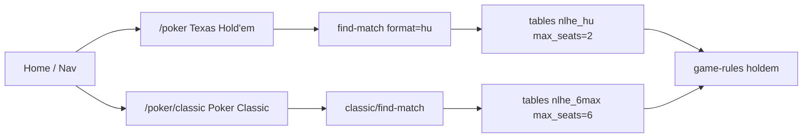
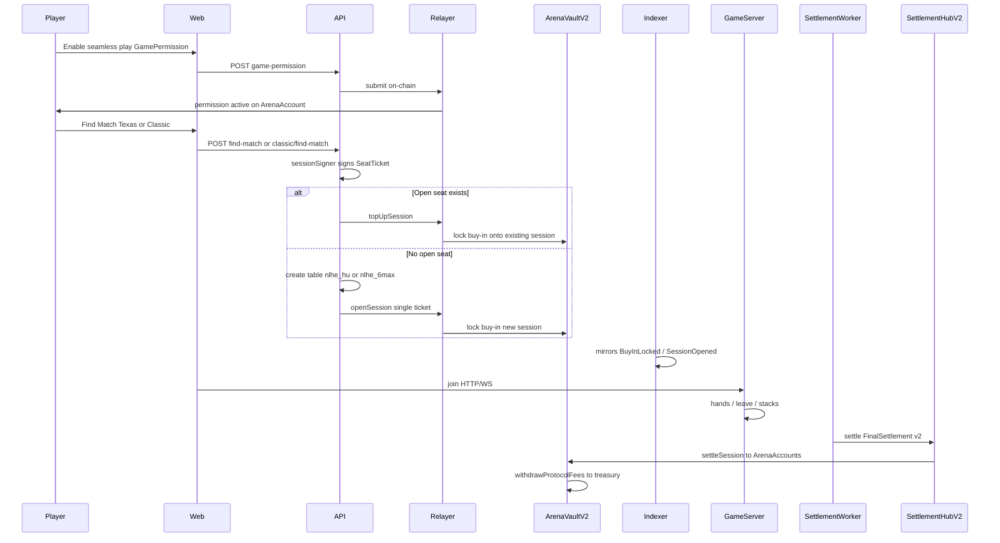

# Mozetto Platform Architecture

**Status:** Arena Account V2 custody live on **Anvil**; Base Sepolia / mainnet V2 contracts not yet deployed in the chain-manifest (deploy scripts exist).  
**Product framing:** On-chain-custodied and settled poker with verifiable off-chain execution — **not** fully trustless mental poker. MetaMask/Coinbase own a deterministic **ArenaAccount** that holds gaming USDC; a one-time **GamePermission** lets Mozetto enter ranked games under caps. Settle returns funds only to the ArenaAccount. The platform cannot withdraw.

This document is the living architecture: games, Arena Account custody, money flow (Anvil + Sepolia), game engine, realtime, Supabase roles, and how the pieces fit together after the V2 / Poker Classic split.

---

## 1. One-sentence model

Mozetto is a **hybrid autonomous poker arena**: players (or their AI loadouts) play No-Limit Hold’em in a realtime TypeScript engine. On-chain mode uses a CREATE2 **ArenaAccount** per owner; buy-ins lock into **ArenaVaultV2** via session-signer SeatTickets under a contract-enforced **GamePermission**; after play, a **quorum of attestors** settles stacks back to those ArenaAccounts. Supabase/Postgres coordinates matchmaking, auth, ratings, and UI mirrors — it must **never** be the final authority over real money.

---

## 2. What changed since the previous write-up

| Area | Before (doc / Instant era) | Now |
|------|----------------------------|-----|
| Custody UX | V1 **InstantPermission** on ArenaVault (EOA → vault) | V2 **ArenaAccount** + **GamePermission**; UI = `PlayPermissionsPanel` (“seamless play”) |
| Vault / hub | ArenaVaultV1, hub EIP-712 `version: "1"` | ArenaVaultV2, PokerSettlementHubV2, EIP-712 `version: "2"` |
| Match open | Wait for ticket pair → 2-ticket `openSession` | **Solo Find Match** opens a 1-player table immediately; joiners use **`topUpSession`** |
| Games | One product labelled “Texas Hold’em”, often 6-max chrome on HU tables | **Texas Hold’em** = heads-up only (`nlhe_hu`); **Poker (Classic)** = 6-max (`nlhe_6max`) |
| AT TABLES chrome | Vault `totalLocked` (stuck until both leave + settle) | Live sum of active `table_sessions.stack`; pending custody shown separately |
| Rated hands | Often `0` / wrong `table_id` | Hand count from `hands` table; pools keyed by variant |
| Migrations | Through `014` | **`015_arena_accounts`**, **`016_poker_classic_texas_hu`** |
| InstantEnablePanel | Primary enable UI | Deprecated re-export of `PlayPermissionsPanel` |
| Rake | Ambiguous / loss-sum bugs | `rake = startSum − endSum`; sweep via `withdrawProtocolFees` → `FEE_TREASURY_ADDRESS` |

Legacy InstantPermission / V1 vault paths remain in the repo for smoke scripts; **new matchmaking uses V2 only**. Env name lag: `INSTANT_SESSION_SIGNER_PRIVATE_KEY` is still the seamless session-signer key.

---

## 3. Monorepo map

| Path | Role |
|------|------|
| `apps/web` | Next.js player UI (Wagmi/SIWE, Arena Account, seamless play, wallet, arenas, tables) |
| `apps/admin` | Ops dashboard (token-gated) |
| `services/api` | REST: auth, lobby, wallet, Arena Account / arena-onchain, admin, verify |
| `services/game-server` | Authoritative NLHE runtime + WebSockets |
| `services/agent-runtime` | AI seat decisions (`shark` / `professor` / `fox` / `machine`) |
| `services/dealer` | Dealer seed commitments, hand seeds, settlement attestation |
| `services/replay-verifier` | Replays canonical event hash chain; signs FinalSettlement |
| `services/chain-indexer` | Sole writer of vault→ledger mirrors; net-worth snapshots |
| `services/settlement-worker` | Proposals, attestations, hub settle, fee sweep, Glicko |
| `packages/game-rules` | Pure NLHE engine |
| `packages/database` | Migrations, ledger, matchmaking (HU + Classic), on-chain match, arena-accounts, ratings |
| `packages/ratings` | Glicko-2 |
| `packages/shared-types` | Zod schemas, seat-ticket hashes, WS types |
| `packages/blockchain` | ABIs (V2), EIP-712 domains, chain config |
| `packages/chain-manifest` | Per-network deployment JSON → generated TS |
| `contracts/` | Foundry: ArenaAccount(+Factory), ArenaVaultV2, hub V2, registry, randomness, MockUSDC |

### Local ports (`scripts/start-local.sh`)

| Port | Process |
|------|---------|
| 8545 | Anvil (chain id `31337`) |
| 3000 | Web |
| 3001 | Admin |
| 4000 | API |
| 4001 | Game-server |
| 4002 | Agent-runtime |
| 4003 | Dealer |
| 4004 | Replay-verifier |
| (no HTTP) | Chain-indexer, settlement-worker |

---

## 4. Two products on one engine

Both products use the same `@mozetto/game-rules` Hold’em engine. Seat count and matchmaking format differ.

| | **Texas Hold’em** | **Poker (Classic)** |
|--|-------------------|---------------------|
| Product id | `texas_holdem` | `poker_classic` |
| Variant | `nlhe_hu` | `nlhe_6max` |
| Seats | **2 only** | **6** |
| Web | `/poker` | `/poker/classic` |
| Lobby | `GET /v1/arena` | `GET /v1/arena/classic` |
| Find Match | `POST /v1/arena/find-match` | `POST /v1/arena/classic/find-match` |
| Rating pool | `hu_holdem_standard` | `nlhe_6max_standard` |
| UI | `ArenaFindMatch product="texas"` | `ArenaFindMatch product="classic"` |

**Shared arena rules**

- Leagues: Bronze $100 / Silver $500 / Gold $1500 / Platinum $5000 (fixed buy-in; blinds = 10% BB / 5% SB of buy-in).
- Find Match allocates randomly within the same ranked pool (league / buy-in / format / mode / chain); empty tables close after ~10 minutes. Players do not pick public ranked tables (WP-040).
- Texas Hold’em: same-pair rated sessions capped at 5 / 24h.
- Poker Classic: multiway fill; Glicko settle only when a session ends with exactly two owners (degenerate HU). Full multiway Glicko is out of scope for now.
- Game-server asserts: `nlhe_hu` ⇒ `max_seats === 2`.

Constants: `packages/database/src/matchmaking.ts` (`VARIANT_TEXAS_HU`, `VARIANT_POKER_CLASSIC`, `arenaFormatConfig`).



---

## 5. Two worlds: Demo vs On-chain

| | **Demo** | **On-chain** |
|--|----------|--------------|
| Auth | Supabase email → session JWT | SIWE → session JWT + ArenaAccount bootstrap |
| Money SoT | Postgres ledger (paper USDC) | ArenaAccount ERC-20 + ArenaVaultV2 locks |
| Buy-in | `lockBuyIn` available → escrow | SeatTicket → `openSession` / `topUpSession` |
| Randomness | Local random seed | Dealer HKDF + VRF word (or mock) |
| Settlement | Cashout / `releaseSession` in DB | Hub quorum → `settleSession` → ArenaAccount |
| UI | Paper faucet | Seamless play, mUSDC/USDC, live chain reads |

**Rule:** Demo ledger *is* the money. On-chain ledger is a **playable mirror** for join/UX/history; the vault + ArenaAccount are the money.

---

## 6. Truth-source hierarchy

| Information | Authoritative source | Postgres role |
|-------------|----------------------|---------------|
| Playable gaming USDC | ArenaAccount ERC-20 balance | Mirror / history |
| Session-locked (real) | `ArenaVaultV2.totalLocked` | Exposure reservations + mirrors |
| Live chips “at tables” (UI) | Game-server stacks → `table_sessions.stack` | Projection for chrome |
| Live hand state | Game-server memory + event log | `hands` / `hand_events` |
| Final payouts | Settlement hub → vault | `settlement_*` |
| Matchmaking queue | API + `seat_tickets` | Coordination SoT |
| Ratings / leagues | Glicko + TS league config | Competitive meta SoT |

---

## 7. Blockchain stack

### 7.1 Networks

| Env | Chain ID | Token | Contracts |
|-----|----------|-------|-----------|
| **Anvil** | `31337` | **mUSDC** (MockUSDC, faucet, EIP-2612) | Fully deployed — `packages/chain-manifest/deployments/anvil.json` |
| **Base Sepolia** | `84532` | Circle test USDC (default) or MockUSDC if `USE_MOCK_USDC=1` | Deploy script `DeploySepolia.s.sol`; manifest addresses still **null** until redeployed |
| **Base Mainnet** | `8453` | Native USDC | Addresses **null**; manifest rejects MockUSDC / faucet |

Local bootstrap: `./scripts/start-local.sh` (optionally `--redeploy`) starts Anvil, runs `DeployLocal.s.sol`, codegens the manifest, syncs addresses into `.env.local`.

Key env: `MOZETTO_CHAIN_ENV` / `NEXT_PUBLIC_CHAIN_ENV` (`anvil` \| `base-sepolia` \| `base`), `ANVIL_RPC_URL`, `BASE_SEPOLIA_RPC_URL`, `FEE_TREASURY_ADDRESS`, factory/vault/hub addresses (public + server).

### 7.2 Contracts (V2)

#### `MockUSDC`
Anvil-only 6-decimal ERC-20 with `faucet()` and EIP-2612 `permit`. Wallet-visible test funds (“Get Test mUSDC”).

#### `ArenaAccount` + `ArenaAccountFactory`
- CREATE2 clone per owner; owner alone can `withdraw` USDC.
- `setGamePermission` — owner-signed EIP-712 grant (session signer, USDC, vault, template, league mask, lifetime / at-risk / buy-in / concurrent caps, expiry).
- `lockBuyIn` — callable by the vault when permission allows; pulls USDC into the vault session.

#### `ArenaVaultV2`
EIP-712 domain: `MozettoArenaVault` / **`2`**.

| Concept | Meaning |
|---------|---------|
| `totalLocked[arena]` | Buy-ins locked for open sessions |
| `openSession` | Relayer opens a session with 1+ SeatTickets (solo table OK) |
| `topUpSession` | Relayer adds a later player’s ticket to an open session |
| `settleSession` | Hub-only; pays each player’s `endBalance` **to their ArenaAccount**; `Σ start == Σ end + rake` |
| `accruedProtocolFees` | Rake accrued in vault |
| `withdrawProtocolFees` | Sweeps fees to `FEE_TREASURY_ADDRESS` |

Legacy `ArenaVaultV1` may still appear in Anvil manifests for reference; matchmaking targets V2.

#### `PokerSettlementHubV2`
EIP-712 domain: `MozettoPokerSettlement` / **`2`**.  
Type: `FinalSettlement(sessionId, finalSequence, eventRoot, handRoot, balanceRoot, totalRake, deadline)`.

- Attestor set + `minSignatures` (default 2).
- `settle` → vault checkpoint + `settleSession`.
- `sessionId` that is already `bytes32` hex is **passed through** (not re-hashed).

#### Supporting
- `TableRegistryV1` — immutable game templates.
- `CheckpointRegistryV1` — sequenced roots (centralized owner today).
- `RandomnessCoordinatorV1` — stub / mock VRF; local uses `ENABLE_MOCK_VRF=1`.

### 7.3 EIP-712 typed data (current)

**SeatTicket V2** (buy-in authorization; player = ArenaAccount address):
```
SeatTicket(
  address player,
  bytes32 gameTemplateId,
  uint256 buyIn,
  bytes32 controllerHash,
  bytes32 agentProfileHash,
  uint64 expiresAt,
  uint256 nonce,
  bytes32 matchmakingPool,
  uint8 leagueBit,
  bool rated
)
```

**GamePermission** (on ArenaAccount; domain `MozettoArenaAccount` / `1`):
```
GamePermission(
  address account,
  address sessionSigner,
  address usdc,
  address vault,
  bytes32 gameTemplateId,
  uint256 leagueMask,
  uint256 lifetimeCommittedCap,
  uint256 maxTotalAtRisk,
  uint256 maxBuyIn,
  uint256 maxConcurrentGames,
  uint64 expiresAt,
  uint256 nonce
)
```

**FinalSettlement** (hub version `2`) — unchanged field list; see §11.

### 7.4 Commitment hashes

| Constant | Meaning |
|----------|---------|
| `NLHE_HU_STANDARD_V1_TEMPLATE_ID` | On-chain template for ranked Hold’em custody (Texas HU today) |
| `POKER_ENGINE_HASH` | Frozen engine identity at open |
| `PROFILE_SET_HASH` | Allowed AI profile set |
| `CONTROLLER_HASH` | Seat decision-controller identity |
| Per-ticket `agentProfileHash` | Chosen AI profile (`fox`, etc.) |

These bind custody to agreed rules/AI; they do not load code on-chain.

---

## 8. Arena Account + seamless play (V2)

**Owner** = MetaMask or Coinbase (SIWE).  
**ArenaAccount** = CREATE2 gaming wallet holding USDC.  
**GamePermission** = one owner signature authorizing Mozetto’s session signer under caps.  
**Seamless play** = Find Match with no wallet popup; Mozetto fronts open/settle gas; rake covers cost.

### 8.1 Enable flow

1. Connect wallet + SIWE → API ensures ArenaAccount deployed (relayer).
2. Fund ArenaAccount (Anvil: faucet mUSDC to owner, then transfer/fund path used by wallet UX).
3. `PlayPermissionsPanel` → `POST /v1/arena/game-permission` with owner-signed GamePermission.
4. Relayer submits on-chain; `GET /v1/arena/play-status` reports enabled when permission active, not expired, and caps allow the league buy-in.

Deprecated aliases: `/v1/arena/instant-permission` rejects with migrate guidance; `InstantEnablePanel` re-exports `PlayPermissionsPanel`.

### 8.2 Find Match (popup-free) — default lifecycle



Set `LEGACY_PAIR_MATCHMAKING=1` only to force the old “wait for pair then dual openSession” path.

### 8.3 Key roles

| Role | Env var | Job |
|------|---------|-----|
| Session relayer | `SESSION_RELAYER_PRIVATE_KEY` | Pays gas: deploy account, permission, `openSession`, `topUpSession` |
| Session signer | `INSTANT_SESSION_SIGNER_PRIVATE_KEY` | Signs SeatTickets under GamePermission — **not** a tx sender |
| Settlement / attestors | `SETTLEMENT_*`, `GAME_ATTESTOR_*`, `REPLAY_ATTESTOR_*`, `DEALER_ATTESTOR_*` | Quorum FinalSettlement; submit `hub.settle` |
| Fee treasury | `FEE_TREASURY_ADDRESS` | Receives swept protocol fees |

Local Anvil often uses distinct Anvil accounts for relayer / signer / attestors — required so hub signatures do not collapse to one address.

### 8.4 Postgres (migration 015)

- `arena_accounts` — profile ↔ owner ↔ CREATE2 address, deploy status  
- `arena_exposure_reservations` — off-chain maxTotalAtRisk / concurrency guards  
- Seat tickets / session players store `arena_account_address` + `owner_address`

---

## 9. How money works (Anvil and Sepolia)

### 9.1 Mental model

```
Owner EOA wallet          ArenaAccount (gaming)         ArenaVaultV2
─────────────────         ─────────────────────         ────────────
MetaMask / Coinbase  →    holds match USDC         →    locks buy-ins
(can fund / withdraw)     (only owner withdraws)        settle → ArenaAccount
                                                        rake → fee treasury
```

Matches always spend from the **ArenaAccount**, never directly from the owner EOA (except the initial fund step).

### 9.2 Anvil (chain 31337) — day-to-day local money

1. Import current **mUSDC** from `anvil.json` / `.env.local` (redeploy changes the address).  
2. Get Test mUSDC → owner wallet.  
3. Fund ArenaAccount; enable seamless play.  
4. Find Match locks league buy-in into the vault under the session.  
5. During play, **navbar AT TABLES** = live stack(s) from Postgres (`getActiveTableStackBalance`). Wins/losses/leave update within ~2s.  
6. On leave/bust, AT TABLES drops immediately; **pending settlement** may still show vault lock until hub settle.  
7. Settle credits `endBalance` to ArenaAccount; remaining GamePermission spend is **not** refilled by settle (anti-drain).  
8. Settlement-worker sweeps accrued fees to `FEE_TREASURY_ADDRESS`.

Token is **valueless mock USDC**. UI labels: `CHAIN TEST · mUSDC`.

### 9.3 Base Sepolia (84532) — intended person-test path

1. Deploy V2 stack with `DeploySepolia.s.sol`; sync `baseSepolia.json` + env (`MOZETTO_CHAIN_ENV=base-sepolia`).  
2. Use Circle test USDC (or mock if explicitly enabled).  
3. Same GamePermission + Find Match + settle path as Anvil.  
4. Operator checklist: distinct session signer ≠ relayer; three hub attestors; dealer `:4003`, replay `:4004`, indexer, settlement-worker running; treasury Safe/EOA set.

Until Sepolia addresses are non-null in the manifest, the product path for on-chain play in this repo is **Anvil**.

### 9.4 UI balance fields (`useMozettoBalances`)

| Field | Meaning |
|-------|---------|
| `displayWallet` | ArenaAccount ERC-20 (playable) |
| `displayLocked` / AT TABLES | Live active seat stacks from `/v1/me` |
| `locked` | On-chain `totalLocked` (custody) |
| `pendingSettlement` | Custody still locked while not seated |
| `ownerWallet` | Owner EOA ERC-20 (not used for buy-ins) |

Session poll ~2s; table WS also refreshes on leave / hand settle.

---

## 10. Game engine

**Package:** `@mozetto/game-rules`  
**Host:** `services/game-server` `TableRuntime` — `max_seats` from `tables.max_seats`.

### Streets

`waiting` → `preflop` → `flop` → `turn` → `river` → `showdown` → `settlement` → …

### Core APIs

`createTable` / `seatPlayer` / `startHand` / `getLegalActions` / `applyAction` / pots / showdown / all-in runout / public+private views.

### Runtime loop

1. Wait until ≥2 seated with stack > 0 (Classic can start with 2 of 6).  
2. Deal hand (on-chain: dealer seed / VRF).  
3. Human WS action or AI controller; `HUMAN_PLAY` seats never auto-act when unbound.  
4. Sync stacks to `table_seats` / `table_sessions`.  
5. Leave vacates seat, completes session, may trigger rated match + settlement readiness.

---

## 11. Dealer, randomness, settlement

### Dealer / replay / worker

- Dealer: commit batch, hand-seed HKDF, attest FinalSettlement.  
- Replay-verifier: verify `canonical_game_events` hash chain; attest.  
- Settlement-worker: build proposal → collect attestations → `hub.settle` → `withdrawProtocolFees` → Glicko (`hu_holdem_standard` or `nlhe_6max_standard` when exactly two owners).

### Quorum

Default `minSignatures = 2` among game / replay / dealer attestors. This is **attested off-chain execution**, not on-chain dealing.

### Rake conservation

```
Σ startLocked == Σ endBalance + rake
```

Worker uses `startSum − endSum` for rake (not sum of losses).

---

## 12. Realtime protocol

WebSocket + HTTP join/leave/action. Schemas in `packages/shared-types`.

Client: `auth`, `subscribe_table`, `join_table`, `leave_table`, `player_action`, `owner_command`, `replay_from`, `ping`.  
Server: `hello`, `snapshot`, `event`, `private_state`, lifecycle messages.

**Authority during a hand:** game-server memory. Chain is not updated per street.

---

## 13. AI agents

Profiles: `shark`, `professor`, `fox`, `machine`. Controllers in `services/game-server/src/controllers.ts`. Agents are loadouts; Glicko is **account-owned**. Seat tickets bind `CONTROLLER_HASH` + `agentProfileHash`.

---

## 14. Supabase / Postgres

Coordination and projection only.

- Demo auth + paper ledger; on-chain SIWE + ArenaAccount rows.  
- Lobby tables/seats/sessions, hands/events, tickets, onchain sessions, indexer mirrors, settlements, ratings, flags, net-worth snapshots.  
- **Indexer is the only writer of vault mirror credits.**  
- Migrations: `001`…`014` plus **`015_arena_accounts`**, **`016_poker_classic_texas_hu`**. Apply with `pnpm db:migrate` against `DATABASE_URL`.

---

## 15. Wallet UX

- Live balances via Wagmi + session AT TABLES.  
- Wallet page: Arena balance, AT TABLES, optional SETTLING, Get Test mUSDC, seamless play panel.  
- User-facing name **Mozetto**; contracts keep Arena* internal names.  
- Net-worth snapshots from indexer + chart API.

---

## 16. What “DEX-like” means here

**Yes:** non-custodial idle funds on ArenaAccount; session-scoped locks; settle conservation; revocable capped automation; transparent rake.  
**No:** AMM/order book; L1 per street; decentralized matching; mental poker. Operator keys (relayer, session signer, attestors) remain in the trust model.

---

## 17. Exists vs missing

### Exists (Anvil / codebase)
- ArenaAccount factory + GamePermission + VaultV2 `openSession`/`topUpSession`/`settleSession`  
- Seamless Find Match (Texas HU + Classic 6-max)  
- Live AT TABLES / pending settlement UX  
- Engine + WS + AI + dealer/replay/settlement-worker + mock VRF  
- Indexer mirrors + demo paper loop  
- Migrations 015–016 applied on linked Supabase  

### Missing for Sepolia / mainnet person money
| Gap | Why |
|-----|-----|
| Sepolia V2 addresses in manifest | Cannot play testnet USDC yet |
| Audits / key hygiene (Safe, KMS) | Production risk |
| Production VRF | Randomness still operator-heavy |
| Full multiway Glicko | Classic ratings only for 2-player sessions |

See `docs/MAINNET_READINESS.md` and `contracts/README.md`.

---

## 18. Terminology

| Term | Definition |
|------|------------|
| **ArenaAccount** | CREATE2 gaming wallet; holds match USDC; owner withdraws |
| **AT TABLES** | UI: live chips at active seats (stacks), not vault lock |
| **GamePermission** | Owner EIP-712 grant for seamless SeatTickets |
| **Poker (Classic)** | 6-max product (`nlhe_6max`, `/poker/classic`) |
| **Texas Hold’em** | Heads-up product (`nlhe_hu`, `/poker`) |
| **Seamless play** | Enabled GamePermission → Find Match without wallet popups |
| **Seat ticket** | EIP-712 V2 authorization to lock a buy-in from ArenaAccount |
| **topUpSession** | Add a joiner’s buy-in to an already-open vault session |
| **openSession** | Create custody session (1+ tickets) |
| **Pending settlement** | Vault still locked after leave; waiting for hub settle |
| **mUSDC** | Anvil MockUSDC (test only) |
| **Fee treasury** | Address receiving swept protocol rake |
| **Instant Mode** | Legacy V1 name; superseded by seamless play / GamePermission |

---

## 19. Practical local verification

1. `./scripts/start-local.sh` (or `--redeploy` for fresh mUSDC/vault).  
2. `pnpm db:migrate` — expect skip through `016`.  
3. Session signer ≠ relayer; three distinct attestors on hub.  
4. Import **current** mUSDC; Get Test mUSDC → fund ArenaAccount → enable seamless play.  
5. `/poker` → 2-seat Texas table; `/poker/classic` → 6-seat Classic table.  
6. AT TABLES follows stack/leave; wallet unlocks after settle.  
7. E2E helpers: `pnpm e2e:instant` (legacy Instant scripts), `scripts/anvil-e2e-arena-account.mjs` (V2).  
8. Foundry: `pnpm test:contracts`.

---

## 20. Related docs & code

- [`contracts/README.md`](../contracts/README.md)  
- [`docs/MAINNET_READINESS.md`](./MAINNET_READINESS.md)  
- Migrations: `packages/database/migrations/001`…`016`  
- Arena API: `services/api/src/arena-onchain.ts`  
- Matchmaking: `packages/database/src/matchmaking.ts`, `ranked-matchmaker.ts`, `onchain-match.ts` (WP-040 audit: `017_matchmaking_allocation_audit.sql`)  
- Engine / runtime: `packages/game-rules`, `services/game-server/src/table-runtime.ts`  
- Balances: `apps/web/src/lib/use-mozetto-balances.ts`  
- UI arenas: `apps/web/src/components/ArenaFindMatch.tsx`  
- Manifest: `packages/chain-manifest/deployments/anvil.json`

---

*Last updated after Arena Account V2 custody, solo openSession + topUpSession matchmaking, live AT TABLES sync, settlement EIP-712 v2 / fee sweep, and the Poker (Classic) vs Texas Hold’em product split.*
