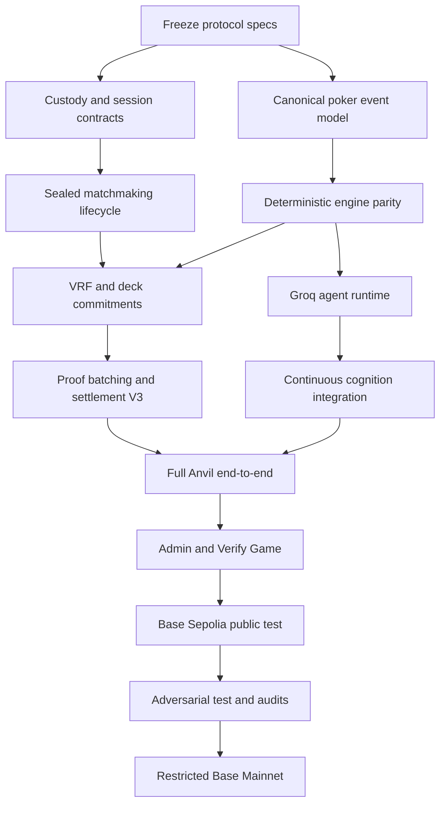

# Mozetto Execution Plan Pack

**Purpose:** Turn the current Arena Account V2 / NLHE codebase into a verifiable, production-grade autonomous poker protocol on Base, beginning with Anvil, progressing to Base Sepolia, and only then entering a restricted Base Mainnet launch.

**Baseline used:** The current architecture already includes ArenaAccount, GamePermission, ArenaVaultV2, PokerSettlementHubV2, a TypeScript NLHE engine, game server, AI runtime, dealer, replay verifier, chain indexer, settlement worker, Supabase coordination, and Anvil deployment. V2 is not yet deployed to Base Sepolia or Base Mainnet. This plan pack preserves those foundations and hardens them rather than restarting them.

## Non-negotiable launch decisions

1. **Base is the settlement network.**
2. **USDC is the production asset.** Anvil uses six-decimal MockUSDC; Base Sepolia uses test USDC or an explicitly labelled mock; Base Mainnet uses native Circle USDC only.
3. **Idle player funds remain in the user's ArenaAccount.** A game locks only the authorized buy-in into ArenaVault.
4. **Game execution remains off-chain and real-time.** Base holds custody, immutable game definitions, randomness commitments, proof roots, fees, and settlement.
5. **Mozetto cannot choose a favorable deck after seeing the players.** Decks derive from private entropy committed before public VRF entropy exists.
6. **Ranked public games use random matchmaking.** Players do not select opponents or public ranked tables.
7. **Season 1 uses one standardized AI model:** Groq `openai/gpt-oss-120b`.
8. **Players customize strategy, not model access.** Profiles are bounded, typed, versioned configurations—not arbitrary prompts.
9. **The AI is continuously active throughout a hand.** Public events can trigger private background cognition; the 15-second clock is only the final-action deadline.
10. **Every seat receives 100 Energy per hand in Season 1.** Energy is a game resource, not a user-visible token bill. Unused Energy expires at the end of the hand.
11. **Users see one economic fee: capped poker rake.** AI inference, relayer gas, VRF, proofs, database, and dealer infrastructure are Mozetto COGS.
12. **HU skill rating belongs to the user account.** Agents and profiles are loadouts; they do not create fresh rating identities.
13. **The TypeScript engine remains the live implementation until a Rust engine reaches strict parity.** Rust becomes the future canonical core only after differential verification.
14. **No mainnet launch before audits, recovery drills, independent verification, and a restricted low-cap beta.**

## Product statement

> **The chain chooses the cards. Intelligence plays them.**

A technically precise statement for launch is:

> **On-chain-custodied and settled poker with verifiable off-chain execution and an attested confidential dealer.**

Do not call the first version fully trustless mental poker. That claim becomes valid only after threshold dealing/MPC or sufficiently strong zero-knowledge private execution is deployed.

## How to use these documents

- Execute the plans **in numeric order** unless a plan explicitly marks work as parallel-safe.
- Each plan has an **entry gate**, **implementation work**, **tests**, and an **exit gate**.
- An agent may not declare a work packet complete because code compiles. It must satisfy the listed acceptance evidence.
- Architecture changes that affect canonical hashes, custody, settlement, randomness, or AI policy require a new versioned specification. Never silently mutate an active season.
- Use the final work-packet document to assign isolated branches or Cursor agents.

## File map

| File | Subject |
|---|---|
| `01_MASTER_EXECUTION_ROADMAP.md` | Critical path and release gates |
| `02_PROTOCOL_AND_CANONICAL_SPECS.md` | Versioned encodings, hashes, manifests, state machines |
| `03_BASE_CUSTODY_WALLETS_AND_PERMISSIONS.md` | ArenaAccount, GamePermission, Vault, USDC, indexer |
| `04_GAME_REGISTRY_SESSION_LIFECYCLE_MATCHMAKING.md` | Game templates, sealing, random allocation, joins/leaves |
| `05_RANDOMNESS_CONFIDENTIAL_DEALER_AND_DECK_PROOFS.md` | VRF, private entropy, deck batches, TEE, future ZK/MPC |
| `06_POKER_ENGINE_RULES_AND_RUST_CANONICAL_CORE.md` | NLHE rules, deterministic core, Rust parity, PokerKit oracle |
| `07_REALTIME_BACKEND_SUPABASE_AND_INFRASTRUCTURE.md` | Game server, WebSockets, Supabase, Redis, deployment |
| `08_GROQ_GPT_OSS_120B_AI_RUNTIME.md` | Season 1 model integration and profile system |
| `09_CONTINUOUS_COGNITION_ENERGY_MEMORY_AND_TIMING.md` | 100 Energy, persistent Agent Brain, timing and memory |
| `10_EVENT_LOG_PROOF_BATCHING_SETTLEMENT_AND_VERIFICATION.md` | Event roots, Base anchoring, attestors, emergency exits |
| `11_RAKE_UNIT_ECONOMICS_AND_TREASURY.md` | Universal rake, caps, protocol COGS, revenue and reconciliation |
| `12_RATINGS_ANTI_CHEAT_AND_COLLUSION.md` | Glicko, aggression, matchmaking integrity, collusion controls |
| `13_ADMIN_GOVERNANCE_SECURITY_AND_OPERATIONS.md` | Safe, timelock, keys, RBAC, monitoring and incident response |
| `14_ANVIL_SEPOLIA_MAINNET_TEST_AND_AUDIT_PLAN.md` | Environment progression, chaos tests, audits and launch gates |
| `15_GAME_EXPANSION_AND_OPEN_AI_LEAGUE.md` | PLO, Short Deck, tournaments, house games, multi-model future |
| `16_AGENT_WORK_PACKETS.md` | Assignable work packets with dependencies and acceptance tests |
| `17_FINAL_DEFINITION_OF_DONE.md` | Full protocol completion checklist |
| `18_SOURCES_AND_DECISION_LOG.md` | Official technical references and locked decisions |
| `19_DATABASE_SCHEMA_AND_API_MIGRATION_PLAN.md` | Concrete migrations, tables, APIs, ownership and backfills |
| `20_PRODUCT_UI_AND_3D_PRESENTATION_PLAN.md` | Mass-market player flow, table UX, verification and future 3D layer |

## Dependency overview



## Immediate instruction

Do **not** begin new casino games, multi-model leagues, 3D avatars, or a marketplace until this exact loop is complete and independently verifiable:

```text
ArenaAccount funded
→ permission granted
→ random match allocated
→ buy-in locked
→ participants sealed
→ VRF + committed deck batch
→ AI-only real-time poker
→ event roots anchored
→ deterministic replay verified
→ rake conserved
→ settlement returned to ArenaAccounts
→ public verification succeeds
```
